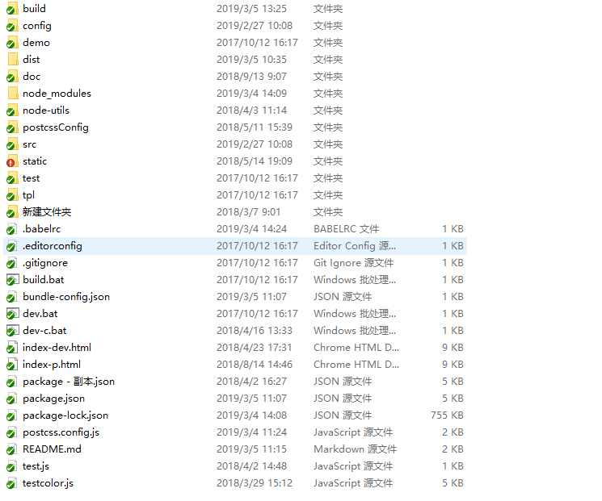
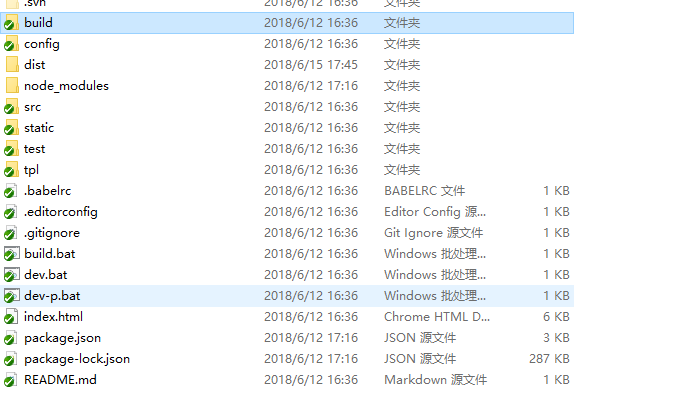
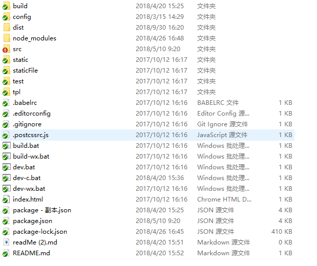
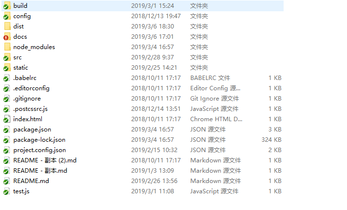
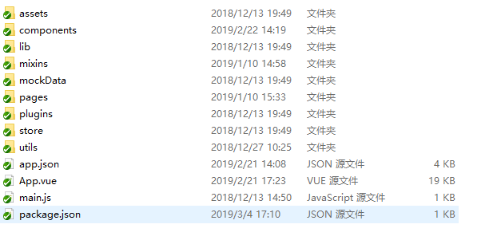
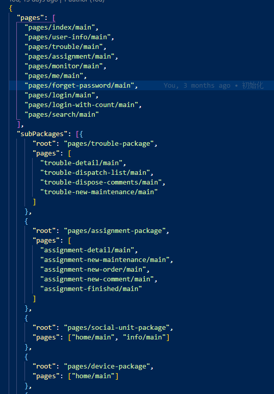
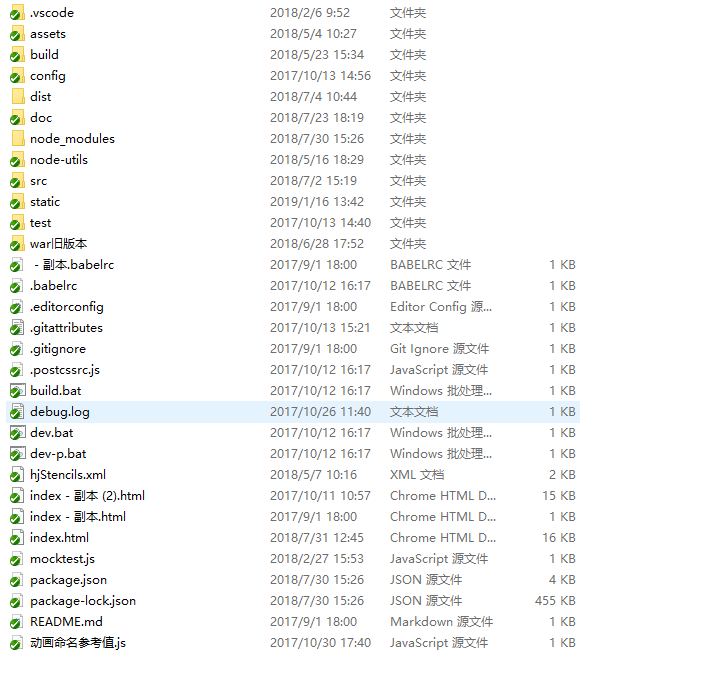
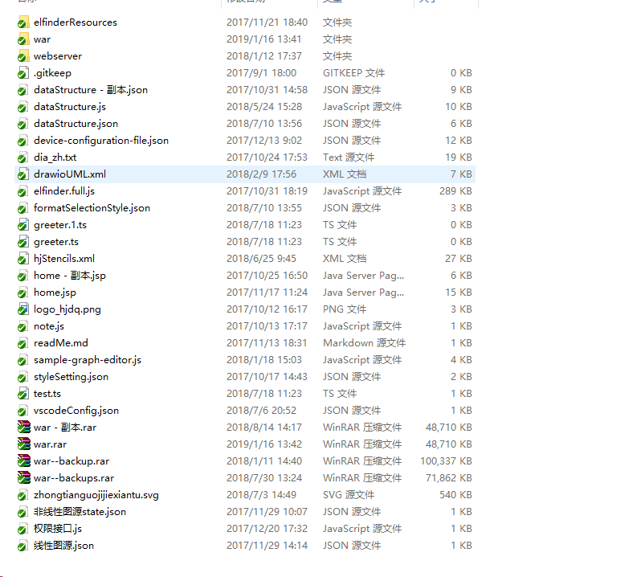
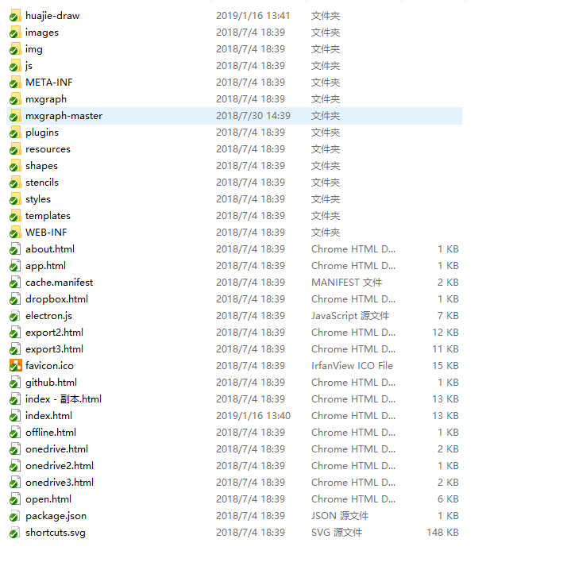
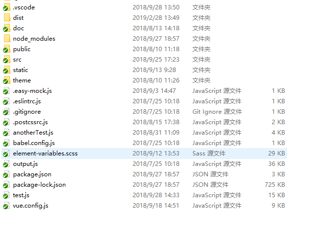

# 项目概览

所属有项目都是基于nodejs作为服务器开发语言，通过webpack打包工具编译源码，npm 包管理器管理各种依赖包,依赖项可以在项目文件夹下的pakage.json文件中查看。电脑必须先安装nodejs，其中node-sass 可能需要c++，ruby语言来编译，node-sass包用于编译css中的sass语法文件为css文件。通过源码地址checkout代码到本地，在项目文件夹开启cmd，输入npm install 安装各种依赖，之后 npm run dev 可以开启开发模式，npm run build 开启编译文件到输出目录（dist或public).具体有什么命令可以执行则需要查看package.json文件中对应的script字段定义了哪些命令。

1. 光伏云系统
2. 报表
3. 移动端App混合webview页面
4. 可定制组态软件（依赖drawio）
5. 大屏可视化定制系统
6. 小程序
  
## 光伏云系统

  源码地址：[https://192.168.1.77/svn/Projects/P15_HuajieSolarCloud_V3.6/2.src/HuajeCloudWebUI](https://192.168.1.77/svn/Projects/P15_HuajieSolarCloud_V3.6/2.src/HuajeCloudWebUI)

1. 项目目录结构说明
  如下图所示：
    - build文件夹下包含构建相关文件
    - config文件夹包含配置文件
    - node-utils包含各种处理脚本
    - src为主要代码源目录
    - static为静态文件
    - package.json为整个项目库的依赖包目录，package.json内部脚本解释如下：
    - dev-p，api代理指向 [https:www.huajiecloud.com/webse](https://www.huajiecloud.com/webserver)
    - dev， api代理指向本地服务器 [http://192.168.1.99/webserver](http://192.168.1.99/webserver)
    - dev-c， api代理指向阿里云服务器但是采用的是http协议，[http://www.huajiecloud.com/webserver](http://www.huajiecloud.com/webserver)
    - build, 构建
    - buildDll, 检查package中的生产依赖是否有变化，有z变化则构建共同的vendor
    - build:dll，强制构建共同的vendor
2. Q: 运行npm build命令后，构建后的文件输出在dist目录,那么dist目录下的文件如何放置在测试服务器端?
   A: 通过FileZila等ftp传输软件链接到测试服务器上去。服务器地址192.168.1.99，账户名：root， 密码：root, 端口：22。把dist/webserver/vuecomponent 文件夹传输到 /home/server_v3/test/webserver 目录下。
3. 注意项目中使用的静态资源elfinderResources文件夹也必须放置在测试服务器的/home/server_v3/test/webserver目录下，而elfinderResources源码则在组件软件项目下的/static文件夹下.
4. 权限说明文档。文档位于doc/user-authorization-management 文件夹下。其源文件为doc/user-authorization-management/new-user-authorization-management.md。那么如何构建new-user-authorization-management.html呢，需要通过vscode的Markdown Preview Enhanced 插件。详情请看[MPE的导出html文档说明](https://shd101wyy.github.io/markdown-preview-enhanced/#/zh-cn/html)

## 报表

  源码地址：[https://192.168.1.77/svn/develop/分布式光伏电站管理系统/trunks/2.src/AppH5_Report](https://192.168.1.77/svn/develop/分布式光伏电站管理系统/trunks/2.src/AppH5_Report)
此为微信webview页面。

1. 项目目录结构说明（同上)
   
2. Q: npm run dev 开启开发模式，支持热更新，而npm run build 开启构建，构建后的文件输出在dist目录，该目录的文件怎么放置在测试服务器？
   A: 把dist/appserver/reports 文件夹上传到192.168.1.99/home/server_v3/test/appserver 文件夹下.
3. npm run dev-p 开启开发模式，并把代理指向 https://www.huajiecloud.com/appserver
## 光伏云移动端App混合webview页面

  源码地址：[https://192.168.1.77/svn/Projects/P15_HuajieSolarCloud_V3.6/2.src/AppH5](https://192.168.1.77/svn/Projects/P15_HuajieSolarCloud_V3.6/2.src/AppH5)
  包含移动端和微信端webview页面，需要注意的是app和微信其源码采用的是不同的组件，app的源码组件大都在/src/components/app文件夹下，而微信的源于引用组件大都在/src/components/wx文件夹下。

1. 项目目录说明(同上)
  
  package.json 文件中各个脚本命令的说明如下，一下命令中以'-wx'为后缀的命令，产生的文件为微信端的webview页面，其源码主要在AppH5\src\components\wx文件夹下，而没有'-wx'结尾的命令所构建的文件为移动端混合页面（webview所使用的页面）
    - dev，api代理指向测试服务器，App服务的地址 [http://192.168.1.82:8899/appserver](http://192.168.1.82:8899/appserver)
    - dev-c，api代理指向阿里云服务器地址 [https://www.huajiecloud.com/appserver](https://www.huajiecloud.com/appserver)
    - dev-wx，api代理指向测试服务器微信服务的地址：[http://192.168.1.82:8899/wxapi](http://192.168.1.82:8899/wxapi)
    - build， 构建app的编译文件
    - build-wx， 构建微信H5的编译文件
2. dist目录下文件夹如何放置在测试服务器端以使得移动端app能够正确连接跳转到相应页面？
   - 微信，需要把构建后的dist/wxapi 文件夹上传到 192.168.1.99/home/server_v3文件夹下。
   - appH5，需要把构建后的dist/appserver 文件夹上传到 192.168.1.99/home/server_v3/test文件夹下

## 小程序

  源码库地址：[https://192.168.1.77/svn/Projects/P24_ElectricalSaftyMS/2.src/safe-energy-cloud](https://192.168.1.77/svn/Projects/P24_ElectricalSaftyMS/2.src/safe-energy-cloud)

1. 项目目录说明（同上）
   
   特别说明的是/docs/miniprogram_npm和/docs/node_moduless两个文件。当构建时，回去dist目录下查找是否已存在这两个文件夹，不存在则会把文件夹及其子文件复制到dist目录下具体请查看build/copyAction.js文件，其中miniprogram_npm为使用构建工具后构建的包，需要上传到微信服务器的。
2. src目录说明
   
   这里需要特别说明的是此项目不同于以上项目，该项目是有多个入口等的，而src/main.js为微信小程序app层级入口，所有的钩子函数在app.vue中，app.json 为小程序的配置文件，在此配置文件可设置页面入口，子包入口等。而pages目录下为各个页面的入口文件以 pages/**/main.js 为入口构建依赖。而该目录下的package.json决定了微信web开发者工具所构建的包及版本。以此和项目文件下的package.json区分开来。
3. 开发，构建说明
   运行npm run dev 开启开发模式，然后采用微信web开发者工具，添加项目目录，双击打开。即可实时开发。每次新增页面，或者新增引入自定义组件时，必须重新编译。重新编译时，必须关闭开发者工具。因为编译文件必须删除dist目录下除了node_modules和miniprogram_npm文件夹以外的所有文件。
   运行npm run build 开启生产模式，完成后打开微信web开发者工具，并点击上传，即可上传代码到微信服务器上，此时该版本为体验版。需要到后台提交审批，完成审批之后才能正式发布。
4. 如何新增页面？
   src/app.json文件如下图，
   
   如上图所示，首先在文件中的pages数组中添加对应的入口文件，并在项目src/pages 目录下创建对应的文件，页面格式参考其他页面，一般包含main.json, main.js,index.vue等文件，store.js视情况而定。而通过main.js入口引入index.vue.main.json则是小程序要求的页面入口配置文件。
5. 原生组件库如wux-weapp,iview-weapp等如何和mpvue框架中的其他库结合使用呢？
   如上所提到，需要在main.json中的usingComponents属相下添加对应的组件，只有这样才可以在index.vue文件中使用其组件，组件相对应的属性事件等请参考原生组件库源码。
6. 踩坑记

- 页面无法销毁。页面跳转时，小程序的webview id 和 page 组件的this绑定在一起。通过this可以读取到原来的数据。
- slots 插槽嵌套时的作用域问题。（比较复杂）
- 无法支持slots插槽中的插槽问题（这使得mpvue包装的组件缺少灵活性，无法更进一步的封装细微功能的组件，大问题）
- 无法检测深层对象属性的变化问题。（如：list对象绑定组件属性时，对象的属性的变化无法更新组件中的属性值）
- 属性设置不支持脏检测，设置一个属性的值，也会把在data（）钩子函数中其他属性值也设置进去。
- 表单组件相关问题：
  - 表单组件必须嵌套在form原生组件中，通过组件中的 @submit="onFormSubmit" @reset="onReset" 等事件监听，并且在表单内部的 button原生组件中 formType="submit"或 formType="reset"来触发事件， 如果表单组件没有嵌套在表单内部，且button没有设置formType则，点击button触发的事件与表单组件中的change事件发生顺序会错乱。

综上所述，从新开始选择开发框架，可能的选择如下：

- 原生组件。
  - 优点：原生，速度快。
  - 缺点：（2018年中） npm包支持不太友好；很多 vue，react中的一些特性，小程序都没有，导致开发非常不便；
- wepy(github 目前的issue数量为130多)
  - 上述mpvue的问题除了数据脏检查，其他问题可能依旧存在。
- taro（github 目前的issue数量为300多）
  - 可能也存在mpvue中存在的问题。
- mpvue(github 目前的issue数量为200多）
  - 存在上述问题

故而，如没有兼容多端小程序的需求，最好的方案是使用原生编写，在使用webpack等工具自定义编译脚本，编译代码，压缩代码。如需快速开发可采用wepy，wepy腾讯支持项目相对靠谱（也需要实际踩坑，以实际踩坑为主）
如有多端需求：从 mpvue， taro等的问题解决速度对比，可能 taro更适合，而wepy支持小程序。

## 组态软件

项目库地址：[https://192.168.1.77/svn/Projects/P15_HuajieSolarCloud_V3.6/2.src/huajie-draw](https://192.168.1.77/svn/Projects/P15_HuajieSolarCloud_V3.6/2.src/huajie-draw)
(注意此项目初始化安装npm包时，即运行npm install命令，需要在管理员命令行的环境下运行)
1. 项目目录结构说明 
   - 如图所示，该目录结构和光伏云系统大同小异。基于vue-cli 2.9版本初始化项目库。
   - 不同之处在于此次项目构建后的文件需要嵌入到drawio构建文件中去。故而index.html必须用到drawio构建文件中的index.html，webpack则以index.html为模板，将构建后的bundle嵌入到index.html中去。而drawio构建后的文件则存放到static，方便开发调试。相关说明文件放在[https://192.168.1.77/svn/Projects/P15_HuajieSolarCloud_V3.6/1.doc/3.设计开发/hj-draw](https://192.168.1.77/svn/Projects/P15_HuajieSolarCloud_V3.6/1.doc/3.设计开发/hj-draw)文件夹下
2. static目录说明 
   此目录主要是elfinderResources以及war包，elfinderResources为后端寻找的文件夹管理插件，此文件需要放置在光伏系统构建文件所在目录下192.168.1.99/home/server_v3/test/webserver。而war包则是drawio构建后的文件，如下图： 其中需要特别指出的是，index.html 已被改写，故而不能使用原来的drawio产生的原文件。mxgraph-master为github上mxgraph项目库的文件，由于index.html中直接指明远程连接地址，为方便开发故而下载在本地。
   - Q: 此war包为drawio哪个版本呢？
     A: 可通过static/war目录下的ChangeLog.md查看该项目为drawio的当前的哪个版本，以及所依赖的mxgraph的版本号；
   - Q: 如何根据最新的drawio版本更新war包呢？
     A：访问[drawio项目库](https://github.com/jgraph/drawio)，可看到src/main文件夹，点击进去可看到java与webapp文件夹，而webapp文件夹在以前版本就是war文件夹，下载该文件夹修改文件名称为war并覆盖，覆盖前需要先把static/war/index.html以及static/war/resources/dia_zh.txt 等文件备份到/static文件夹下，和其最新的文件meger,同时也要跟新更目录的index.html文件。并且需要把[drawio项目库](https://github.com/jgraph/drawio)中的ChangeLog.md完全覆盖/static/war/ChangeLog.md 文件。根据最新的ChangeLog.md中指定的mxgraph版本号，去[mxgraph库](https://github.com/jgraph/mxgraph)中下载对应的文件，并覆盖mxgraph-master.
   - Q: 该项目构建后的文件放置在哪儿，怎么使用与drawio构建后的war包相结合?
     A: npm run build 命令构建后dist目录下生成war文件夹,该文件包含index.html与huajie-draw文件夹，只需要把index.htmly与huajie-draw复制到static/war目录下即可，之后需要把war文件夹放置于192.168.1.99/home/server_v3/test 目录下。
3. 组态软件和光伏云系统的联动说明
   光伏云系统通过elfinderResource访问管理阿里云服务器上的组态文件，故而需要修改elfinderResource的文件使其跳转到本项目的入口文件index.html，而static/elfinderResource为修改后的文件。光伏云系统与组件软件通过elfinderResource中间层传递参数等。

## 大屏可视化定制系统

项目库地址：[https://192.168.1.77/svn/Projects/P23_HuajieDataV/2.src/VisualCustomization](https://192.168.1.77/svn/Projects/P23_HuajieDataV/2.src/VisualCustomization)

1. 项目目录说明  如图所示，该目录文件和以上目录文件结构大体上不同，因为该项目为基于vue-cli3.0构建，webpack等也升级到4.0.webpack相关配置项可在vue.config.js中修改。最新的vue-cli工具，简化了webpack的配置，很多开箱即用的东西，也可完成个人配置，详情需要查看[vue-cli3.0](https://cli.vuejs.org/zh/config/)说明文档，以及[webpack4.0](https://webpack.docschina.org/configuration/)说明文档.
   - publick为公开目录，内部有index.html模板文件。
   - theme文件夹以及element-variables.css为主题定制相关文件可参考[elements主题定制说明](http://element.eleme.io/#/zh-CN/component/custom-theme)
   - doc包含需求说明文档以及原型等文件，项目设计说明（详见："doc/customComponentConfig/20180926web组件设计文档/20180926web组件设计文档.html")
2. package.json脚本说明，
   - serve，npm run serve 运行开发
   - build，npm run build 构建
   - svg， npm run svg 构建svg icon组件，详见vue-svgicon包的readMe文件
   - lint, npm run lint 格式检查
  
由于该项目还未正式上线只在本地开发，还未部署在阿里云服务器以及测试服务。  
fsfsfsf